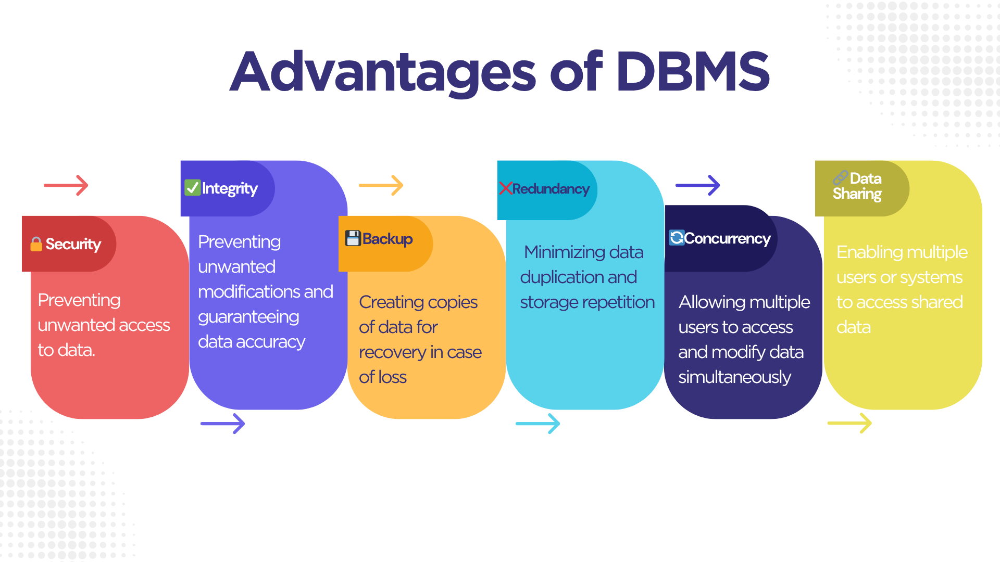

# Database Report

## 1. Comparison: Flat File Systems vs. Relational Databases
The table below compares Flat File Systems and Relational Databases based on several important characteristics:

| Feature           | Flat File Systems                         | Relational Databases                      |
|------------------|-------------------------------------------|-------------------------------------------|
| Structure     | Stores data in plain text files, typically one table per file. | Organized into tables with defined schemas (columns, data types). |
| Data Redundancy | High redundancy due to duplication in separate files. | Minimal redundancy using primary/foreign keys. |
| Relationships | No relationships between data entries.   | Strong support for relationships via keys. |
| Example Usage  | Simple Excel/CSV files, small local data storage. | Business systems, web applications, CRMs. |
| Drawbacks| Difficult to manage, lacks data integrity, prone to inconsistency. | More complex to set up but offers scalability and consistency. |

## 2. Mind Map: Advantages of DBMS

The following mind map illustrates the key advantages of Database Management Systems (DBMS), including Security, Integrity, Backup, Redundancy, Concurrency, and Data Sharing.

---

 Explanation of Each Feature:

| Feature          | Meaning in English                                             |
|------------------|----------------------------------------------------------------|
|  Security       | Protecting data from unauthorized access                      |
|  Integrity      | Ensuring data accuracy and preventing unauthorized changes    |
|  Backup         | Creating copies of data for recovery in case of loss          |
|  Redundancy     | Minimizing data duplication and storage repetition            |
|  Concurrency    | Allowing multiple users to access and modify data simultaneously |
|  Data Sharing   | Enabling multiple users or systems to access shared data      | 

## 3. Roles in a Database System

A successful database project requires collaboration between several specialized roles. Below are the main roles and their responsibilities:

 System Analyst
- Analyzes business requirements and translates them into system specifications.
- Acts as a bridge between business stakeholders and the technical team.

 Database Designer
- Designs the logical and physical structure of the database.
- Creates entity-relationship diagrams (ERDs) and defines table schemas and relationships.

 Database Developer
- Implements the database structure based on the design.
- Writes SQL queries, stored procedures, triggers, and optimizes database performance.

 Database Administrator (DBA)
- Manages and maintains the database system.
- Responsible for backup, recovery, user access control, performance tuning, and security.

 Application Developer
- Develops applications that interact with the database.
- Uses APIs, backend logic, and front-end integration to enable data operations.

 Business Intelligence (BI) Developer
- Analyzes data stored in the database to generate insights.
- Creates reports, dashboards, and visualizations to support business decision-making.

## 4. Types of Databases

Databases can be categorized based on their structure and deployment model. Below are the main types:

 Relational Databases (RDBMS)
- Store data in structured tables with rows and columns.
- Support SQL (Structured Query Language) for querying and manipulating data.
- **Examples**: MySQL, PostgreSQL, Oracle, Microsoft SQL Server.
- **Use Case**: Banking systems, HR systems, CRM applications.

 Non-Relational Databases (NoSQL)
- Store data in flexible formats such as key-value pairs, documents, graphs, or wide-column stores.
- Do not require a fixed schema.
- **Examples**: MongoDB (document), Cassandra (wide-column), Redis (key-value).
- **Use Case**: Real-time analytics, social media apps, big data applications.

---

 Cloud Databases
- Hosted and managed on cloud platforms.
- Provide scalability, automated backups, and remote access.
- **Examples**: Amazon RDS, Google Cloud Spanner, Azure SQL Database.
- **Use Case**: Web apps, SaaS platforms, global enterprise systems.

---

 Centralized Databases
- All data is stored and managed in a single location.
- Easy to manage but can be a single point of failure.
- **Use Case**: Small businesses, local systems.

---

 Distributed Databases
- Data is distributed across multiple locations or servers.
- Offers better reliability and performance for large-scale systems.
- **Use Case**: Global e-commerce platforms, content delivery networks.

---

### 📌 Summary Table:

| Type                  | Description                                   | Example Uses                       |
|-----------------------|-----------------------------------------------|------------------------------------|
| Relational            | Structured tables and SQL support             | Banking, HR, CRM                   |
| Non-Relational (NoSQL)| Flexible schema for unstructured data         | Big data, social apps              |
| Centralized           | All data stored in one location                | Local applications                 |
| Distributed           | Data spread across multiple systems/servers   | E-commerce, large systems          |
| Cloud-based           | Hosted on cloud platforms                     | Web apps, scalable enterprise apps |

## 5. Cloud Storage & Databases

Cloud storage and databases are essential parts of modern computing. Here's how they relate:

 What is Cloud Storage?
- Cloud storage allows users to store data online using third-party services.
- It provides remote access, scalability, and automatic backups.

 How Cloud Storage Supports Databases
- Many modern databases are cloud-hosted, offering managed services.
- They allow users to create, store, and access databases from anywhere.
- Examples: Amazon RDS, Google Cloud Spanner, Azure SQL Database.

Advantages of Cloud-Based Databases
- Scalability: Easily scale resources as data grows.
- Availability: High uptime and global access.
- Backup & Recovery: Automatic backups and disaster recovery options.
- Managed Services: No need to worry about installation or maintenance.

 Disadvantages / Challenges
- Dependency on Internet: Requires stable internet access.
- Data Privacy Concerns: Sensitive data stored on external servers.
- Recurring Costs: Subscription-based pricing may become expensive long-term.
- Limited Customization: Less control over low-level configuration.

